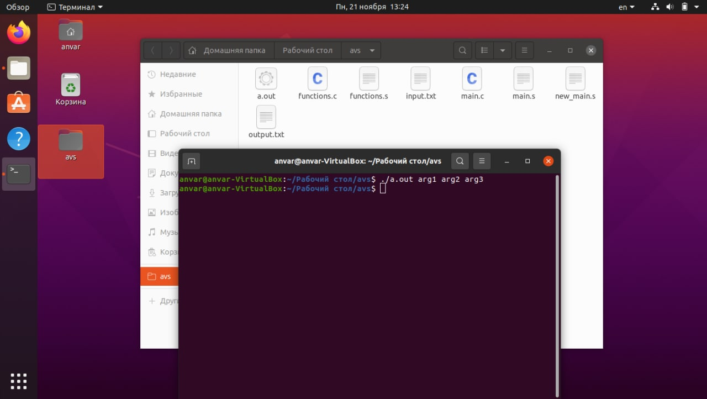
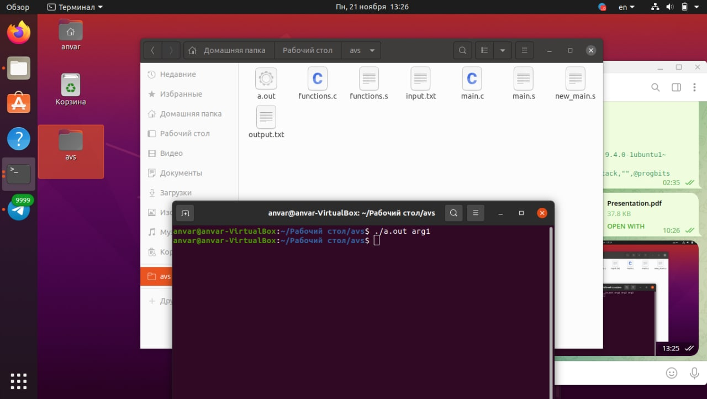

# ИДЗ_3

## Хасанов Анвар, БПИ216, Вариант 25

Примечание: работа по критериям на 7

### Написание кода на С

Напишем код на языке С. Сразу разделим на два файла

Файл [main.c](files/main.c)

```c
#include <stdio.h>

FILE *fin;
FILE *fout;
// Машинный ноль
double eps = 0.000001;

extern void readCoords();

int main(int argc, char** argv) {
    // Проверка, что передается 3 аргумента
    if (argc != 3) {
        return 0;
    }
    fin = fopen(*(argv + 1), "r");
    fout = fopen(*(argv + 2), "w");
    // Проверка, что файл прочитался
    if (!fin) {
        return 0;
    }
    // Вызов функции чтения координат
    readCoords();
    return 0;
}
```

Файл [functions.c](files/functions.c)

```c
//
// Created by anvar on 18.11.2022.
//
#include <stdbool.h>
#include <math.h>
#include <stdio.h>

extern FILE *fin;
extern FILE *fout;
extern double eps;

// Функция для нахождения расстояние между двумя точками
double findLength(const double x1, const double y1,const double x2,const double y2) {
    return sqrt((x1 - x2) * (x1 - x2) + (y1 - y2) * (y1 - y2));
}

// Проверка, что 4 точки лежат на одной окружности
// Передаются 4 координаты х и у
bool check(const double x[4], const double y[4]) {
    double a = findLength(x[0], y[0], x[1], y[1]);
    double b = findLength(x[2], y[2], x[1], y[1]);
    double c = findLength(x[3], y[3], x[2], y[2]);
    double d = findLength(x[0], y[0], x[3], y[3]);
    double d1 = findLength(x[0], y[0], x[2], y[2]);
    double d2 = findLength(x[1], y[1], x[3], y[3]);
    // Пользуемся теоремой Птолемея
    // Сумма произведений двух противоположных сторон
    double sidemult = a*c + b*d;
    // Произведение диагоналей
    double diagmult = d1 * d2;
    // Сравниваем два значения с машинным нулем
    return (sidemult - diagmult < eps && sidemult - diagmult > -eps);
}

void readCoords() {
    double x[4];
    double y[4];
    // Читаем координаты
    fscanf(fin, "%lf %lf", &x[0], &y[0]);
    fscanf(fin, "%lf %lf", &x[1], &y[1]);
    fscanf(fin, "%lf %lf", &x[2], &y[2]);
    fscanf(fin, "%lf %lf", &x[3], &y[3]);
    if(check(x, y)) {
        fprintf(fout, "%s", "YES");
    } else {
        fprintf(fout, "%s", "NO");
    }
}
```

Для решения данной задачи было решено пользоваться теоремой Птолемея, которая гласит, что если сумма произведений двух противоположных строн четырехугольника равна произведению диагоналей, то этот четырехугольник вписан в окружность. 

Для упрощения реализации пользователь должен вводить координаты по (или против) часовой стрелке

### Компиляция в ассемблер

Скомпилируем программу на язык ассемблер, используя следующие флаги:

```c
$ gcc -O0 -Wall -masm=intel -S -fno-asynchronous-unwind-tables -fcf-protection=none
main.c functions.c
```

У нас убраны лишние макросы и код стал компактнее. Также компиляция была произведена в два файла. 

### Запуск программы

Запустим программу через консоль

```nasm
$ gcc main.s fucntion.s -lm
$ ./a.out input.txt output.txt
```

Флаг -lm означает, что будет использована сторонняя функция sqrt 

Файл input.txt содержит входные данные, output.txt будет содержать выходные

Содержимое файла input.txt

```c
1 1
1 0
0 0
0 1
```

Содержимое файла output.txt

```c
YES
```

Программа работает

### Рефакторинг кода

Теперь отрефакторим полученный код за счет оптимизации использования регистров процессора. Добавим комментарии, которые поясняют эквивалентное представление переменных в языке С

Файл [main.s](files/main.s)

```nasm
.file  "main.c"
  .intel_syntax noprefix
  .text
  .comm  fin,8,8                # Определеяем файл для ввода
  .comm  fout,8,8               # Определяем файл для вывода
  .globl  eps                   # Определяем эпсилон
  .section  .data
argc:                           # Ссылка на аргументы командной строки
   .space 4                     # Выделяем 4 байт
  .align 8
  .type  eps, @object
  .size  eps, 8
eps:
  .long  2696277389             # Передаем значение 0.000001 для эпсилона
  .long  1051772663
  .section  .rodata
.format_in:                     # Формат для чтения из файла
  .string  "r"
.format_out:                    # Формат для вывода в файл
  .string  "w"
  .text
  .globl  main
  .type  main, @function
main:
  push  rbp
  mov  rbp, rsp
  sub  rsp, 16
  mov       argc[rip], edi           # Число аргументов командной строки
  mov       r12, rdi
  mov       r13, rsi                 # Адрес массива аргументов
  cmp       r12, 3                   # Проверяем, что число аргументов равно 3
  je        .ok                      # Если равно, то идем дальше
  mov       eax, 0
  jmp       .leave                   # Иначе выходим из программы
.ok:
  lea       rsi, .format_in[rip]     # Передаем формат открытия файла "r"
  mov       rdi, [r13+8]             # Передаем название файла "input.txt"
  call      fopen                    # Открываем файл
  mov       fin[rip], rax
  mov       rax, QWORD PTR -16[rbp]
  lea       rsi, .format_out[rip]    # Передаем формат открытия файла "w"
  mov       rdi, [r13+16]            # Передаем название файла "output.txt"
  call      fopen                    # Открываем файл
  mov       fout[rip], rax           # Сохраняем указатель на файл
  mov       rax, fin[rip]            # Передаем в rax укзатель на файл для ввода
  test      rax, rax                 # Проверяем, что файл открылся корректно
  jne       .call_func               # Если все хорошо, то переходим к блоку call_func
  mov       eax, 0
  jmp  .leave                        # Иначе выходим из программы
.call_func:
  mov  eax, 0
  call  readCoords
  mov  eax, 0
.leave:                              # Выход из программы
  leave
  ret
  .size  main, .-main
  .ident  "GCC: (Ubuntu 9.4.0-1ubuntu1~20.04.1) 9.4.0"
  .section  .note.GNU-stack,"",@progbits
```

Файл [functions.s](files/functions.s)

```c
.file  "functions.c"
  .intel_syntax noprefix
  .text
  .globl  findLength
  .type  findLength, @function
findLength:                             # Функция для нахождения расстояния между двумя координатами
  push  rbp
  mov  rbp, rsp
  sub  rsp, 32                          # Выравниваем стэк
  movsd  [rbp-8], xmm0                  # Переменная х1
  movsd  [rbp-16], xmm1                 # Переменная у1
  movsd  [rbp-24], xmm2                 # Переменная х2
  movsd  [rbp-32], xmm3                 # Переменная у2
  movsd  xmm0, [rbp-8]                  # ---------
  movapd  xmm1, xmm0                    # х1 - х2
  subsd  xmm1, [rbp-24]                 # ---------
  movsd  xmm0, [rbp-8]                  # х1 - х2
  subsd  xmm0, [rbp-24]                 # ---------
  mulsd  xmm1, xmm0                     # (х1 - х2) * (х1 - х2)
  movsd  xmm0, [rbp-16]                 # ---------
  movapd  xmm2, xmm0                    # у1 - у2
  subsd  xmm2, [rbp-32]                 # ---------
  movsd  xmm0, [rbp-16]                 # у1 - у2
  subsd  xmm0, [rbp-32]                 # ---------
  mulsd  xmm0, xmm2                     # (у1 - у2) * (у1 - у2)
  addsd  xmm0, xmm1                     # Сложение двух умножений
  call  sqrt                            # Вызываем функцию sqrt для выражения
  leave
  ret
  .size  findLength, .-findLength
  .globl  check
  .type  check, @function
check:
  push  rbp
  mov  rbp, rsp
  sub  rsp, 80                          # Выравнивание стэка
  mov  [rbp-72], rdi                    # х[4]
  mov  [rbp-80], rsi                    # y[4]
  mov  rax, [rbp-80]                    # Передаем в функцию y[1]
  add  rax, 8                           # Выравнивание стэка
  movsd  xmm2, [rax]
  mov  rax, [rbp-72]                    # Передаем в функцию x[1]
  add  rax, 8                           # Выравнивание стэка
  movsd  xmm1, [rax]
  mov  rax, [rbp-80]                    # Передаем в функцию y[0]
  movsd  xmm0, [rax]
  mov  rax, [rbp-72]                    # Передаем в функцию x[0]
  mov  rax, [rax]
  movapd  xmm3, xmm2
  movapd  xmm2, xmm1
  movapd  xmm1, xmm0
  movq  xmm0, rax
  call  findLength                      # Вызываем функцию, чтобы найти расстояние между координатами
  movq  rax, xmm0
  mov  [rbp-64], rax                    # Сохраняем значение переменной "a"
  mov  rax, [rbp-80]                    # Передаем в функцию y[1]
  add  rax, 8                           # Выравнивание стэка
  movsd  xmm2, [rax]
  mov  rax, [rbp-72]                    # Передаем в функцию x[1]
  add  rax, 8                           # Выравнивание стэка
  movsd  xmm1, [rax]
  mov  rax, [rbp-80]                    # Передаем в функцию y[2]
  add  rax, 16                          # Выравнивание стэка
  movsd  xmm0, [rax]
  mov  rax, [rbp-72]                    # Передаем в функцию x[2]
  add  rax, 16                          # Выравнивание стэка
  mov  rax, [rax]
  movapd  xmm3, xmm2
  movapd  xmm2, xmm1
  movapd  xmm1, xmm0
  movq  xmm0, rax
  call  findLength                      # Вызываем функцию, чтобы найти расстояние между координатами
  movq  rax, xmm0
  mov  [rbp-56], rax                    # Сохраняем значение переменной "b"
  mov  rax, [rbp-80]                    # Передаем в функцию y[2]
  add  rax, 16                          # Выравнивание стэка
  movsd  xmm2, [rax]
  mov  rax, [rbp-72]                    # Передаем в функцию x[2]
  add  rax, 16                          # Выравнивание стэка
  movsd  xmm1, [rax]
  mov  rax, [rbp-80]                    # Передаем в функцию y[3]
  add  rax, 24                          # Выравнивание стэка
  movsd  xmm0, [rax]
  mov  rax, [rbp-72]                    # Передаем в функцию x[3]
  add  rax, 24                          # Выравнивание стэка
  mov  rax, [rax]
  movapd  xmm3, xmm2
  movapd  xmm2, xmm1
  movapd  xmm1, xmm0
  movq  xmm0, rax
  call  findLength                      # Вызываем функцию, чтобы найти расстояние между координатами
  movq  rax, xmm0
  mov  [rbp-48], rax                    # Сохраняем значение переменной "c"
  mov  rax, [rbp-80]                    # Передаем в функцию y[3]
  add  rax, 24                          # Выравнивание стэка
  movsd  xmm2, [rax]
  mov  rax, [rbp-72]                    # Передаем в функцию x[3]
  add  rax, 24                          # Выравнивание стэка
  movsd  xmm1, [rax]
  mov  rax, [rbp-80]                    # Передаем в функцию y[0]
  movsd  xmm0, [rax]
  mov  rax, [rbp-72]                    # Передаем в функцию x[0]
  mov  rax, [rax]
  movapd  xmm3, xmm2
  movapd  xmm2, xmm1
  movapd  xmm1, xmm0
  movq  xmm0, rax
  call  findLength                      # Вызываем функцию, чтобы найти расстояние между координатами
  movq  rax, xmm0
  mov  [rbp-40], rax                    # Сохраняем значение переменной "d"
  mov  rax, [rbp-80]                    # Передаем в функцию y[2]
  add  rax, 16                          # Выравнивание стэка
  movsd  xmm2, [rax]
  mov  rax, [rbp-72]                    # Передаем в функцию x[2]
  add  rax, 16                          # Выравнивание стэка
  movsd  xmm1, [rax]
  mov  rax, [rbp-80]                    # Передаем в функцию y[0]
  movsd  xmm0, [rax]
  mov  rax, [rbp-72]                    # Передаем в функцию x[0]
  mov  rax, [rax]
  movapd  xmm3, xmm2
  movapd  xmm2, xmm1
  movapd  xmm1, xmm0
  movq  xmm0, rax
  call  findLength                      # Вызываем функцию, чтобы найти расстояние между координатами
  movq  rax, xmm0
  mov  [rbp-32], rax                    # Сохраняем значение переменной "d1"
  mov  rax, [rbp-80]                    # Передаем в функцию y[3]
  add  rax, 24                          # Выравнивание стэка
  movsd  xmm2, [rax]
  mov  rax, [rbp-72]                    # Передаем в функцию x[3]
  add  rax, 24                          # Выравнивание стэка
  movsd  xmm1, [rax]
  mov  rax, [rbp-80]                    # Передаем в функцию y[1]
  add  rax, 8                           # Выравнивание стэка
  movsd  xmm0, [rax]
  mov  rax, [rbp-72]                    # Передаем в функцию x[1]
  add  rax, 8                           # Выравнивание стэка
  mov  rax, [rax]
  movapd  xmm3, xmm2
  movapd  xmm2, xmm1
  movapd  xmm1, xmm0
  movq  xmm0, rax
  call  findLength                      # Вызываем функцию, чтобы найти расстояние между координатами
  movq  rax, xmm0
  mov  [rbp-24], rax                    # Сохраняем значение переменной "d2"
  movsd  xmm0, [rbp-64]                 # ------------
  movapd  xmm1, xmm0                    # a * c
  mulsd  xmm1, [rbp-48]                 # ------------
  movsd  xmm0, [rbp-56]                 # b * d
  mulsd  xmm0, [rbp-40]                 # ------------
  addsd  xmm0, xmm1                     # a * c + b * d
  movsd  [rbp-16], xmm0
  movsd  xmm0, [rbp-32]                 # ------------
  mulsd  xmm0, [rbp-24]                 # d1 * d2
  movsd  [rbp-8], xmm0                  # ------------
  movsd  xmm0, [rbp-16]                 # ------------
  movapd  xmm1, xmm0                    # sidemult - diagmult
  subsd  xmm1, [rbp-8]                  # ------------
  movsd  xmm0, eps[rip]                 # Записываем eps
  comisd  xmm0, xmm1                    # Проверяем, что eps больше
  jbe  .eax_zero
  movsd  xmm0, [rbp-16]
  subsd  xmm0, [rbp-8]                  # sidemult - diagmult
  movsd  xmm1, eps[rip]
  movq  xmm2, .LC0[rip]
    xorpd  xmm1, xmm2                   # -eps
    comisd  xmm0, xmm1                  # Проверяем, что -eps меньше
    jbe  .eax_zero
    mov  eax, 1
    jmp  .leave
  .eax_zero:
    mov  eax, 0
  .leave:
    and  eax, 1
    leave
    ret
    .size  check, .-check
    .section  .rodata
  .format_in:                           # Формат для чтения из файла
    .string  "%lf %lf"
  .yes:                                 # Строка для вывода
    .string  "YES"
  .no:                                  # Строка для вывода
    .string  "NO"
    .text
    .globl  readCoords
    .type  readCoords, @function
  readCoords:                           # Функция для чтения координат из файла
    push  rbp
    mov  rbp, rsp
    sub  rsp, 80                        # Выравниваем стэк
    mov  rax, QWORD PTR fs:40
    mov  [rbp-8], rax
    xor  eax, eax
    mov  rax, fin[rip]                  # Передаем файл для открытия
    lea  rcx, [rbp-48]                  # &y[0]
    lea  rdx, [rbp-80]                  # &x[0]
    lea  rsi, .format_in[rip]           # Передаем формат для открытия
    mov  rdi, rax
    mov  eax, 0
    call fscanf                         # Вызываем функцию fscanf
    mov  rax, fin[rip]                  # Передаем файл для открытия
    lea  rdx, [rbp-48]                  # &y[1]
    lea  rcx, 8[rdx]
    lea  rdx, [rbp-80]                  # &x[1]
    add  rdx, 8                         # Выравниваем стэк
    lea  rsi, .format_in[rip]           # Передаем формат для открытия
    mov  rdi, rax
    mov  eax, 0
    call fscanf                         # Вызываем функцию fscanf
    mov  rax, fin[rip]                  # Передаем файл для открытия
    lea  rdx, [rbp-48]                  # &y[2]
    lea  rcx, 16[rdx]
    lea  rdx, [rbp-80]                  # &x[2]
    add  rdx, 16                        # Выравниваем стэк
    lea  rsi, .format_in[rip]           # Передаем формат для открытия
    mov  rdi, rax
    mov  eax, 0
    call fscanf                         # Вызываем функцию fscanf
    mov  rax, fin[rip]                  # Передаем файл для открытия
    lea  rdx, [rbp-48]                  # &y[3]
    lea  rcx, 24[rdx]
    lea  rdx, [rbp-80]                  # &x[3]
    add  rdx, 24                        # Выравниваем стэк
    lea  rsi, .format_in[rip]           # Передаем формат для открытия
    mov  rdi, rax
    mov  eax, 0
    call fscanf                         # Вызываем функцию fscanf
    lea  rdx, [rbp-48]                  # Передаем в функцию check ссылку на массив "y"
    lea  rax, [rbp-80]                  # Передаем в функцию check ссылку на массив "x"
    mov  rsi, rdx
    mov  rdi, rax
    call  check                         # Вызываем функцию check
    test  al, al
    je  .write_no                       # Если вернулся false, то идем к write_no
    mov  rax, fout[rip]                 # Передааем файл для записи
    mov  rcx, rax
    mov  edx, 3
    mov  esi, 1
    lea  rdi, .yes[rip]                 # Передаем сообщение "YES" в файл
    call  fwrite                        # Записываем в файл
    jmp  .L15
  .write_no:                            # Функция, чтобы записать "NO" в файл
    mov  rax, fout[rip]                 # Передааем файл для записи
    mov  rcx, rax
    mov  edx, 2
    mov  esi, 1
    lea  rdi, .no[rip]                  # Передаем сообщение "NO" в файл
    call  fwrite                        # Записываем в файл
  .L15:
    nop
    mov  rax, [rbp-8]
    xor  rax, QWORD PTR fs:40
    je  .leave2
    call  __stack_chk_fail@PLT
  .leave2:                              # Выход из функции
    leave
    ret
    .size  readCoords, .-readCoords
    .section  .rodata
    .align 16
  .LC0:
    .long  0
    .long  -2147483648
    .long  0
    .long  0
    .ident  "GCC: (Ubuntu 9.4.0-1ubuntu1~20.04.1) 9.4.0"
    .section  .note.GNU-stack,"",@progbits
```

Файлы до рефакторинга: [prefunc.s](files/prefunc.s), [premain.s](files/premain.s)

### Тестирование

[Файлы с тестами](tests)
| Данные в файле input.txt | Данные в файле output.txt |
| --- | --- |
| 3 3
3 0
0 0
0 3 | YES |
| 3.42   2.24
3.7     -1.8
-3.2   -2.5
-2.7   3 | YES |
| 5 0
0 0
-10 2
0 10 | NO |
| 0 0
0 2
1 2
1 0 | NO |
| 4 0
0 -4
-4 0
0 4 | YES |

Теперь проверим работу программы, если будет переданно не 3 аргумента

 





Программа не завершается аварийно, значит все хорошо
